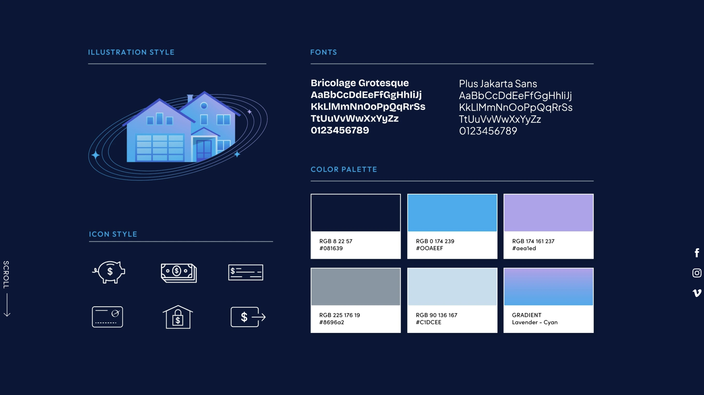
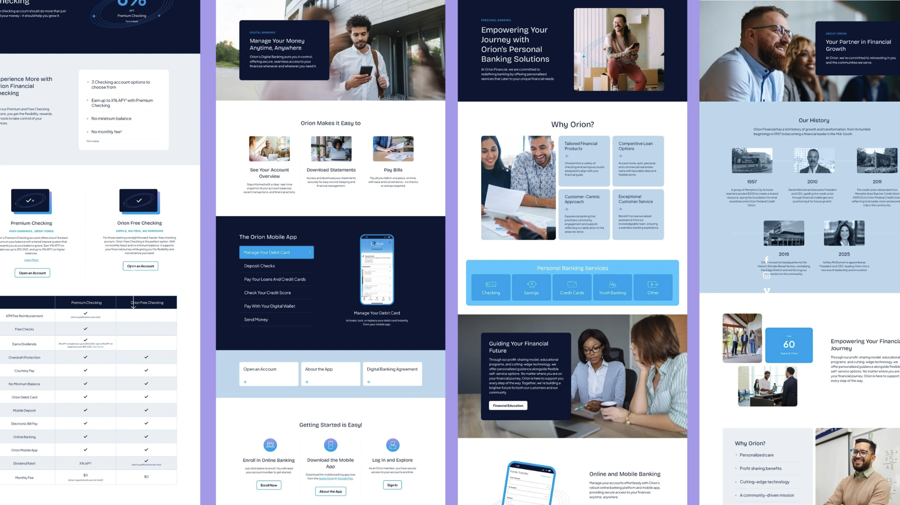

# My Process

## Branding Research

I started by doing research on the Orion Financial brand. It was important to me that this application have the same look and feel as an offical Orion product. So, I went to the Orion Financial website and studied the design system that the marketing website is using. Through my poking around, I was able to locate the name of the local business who handled the Orion Financial branding changes in 2025, [Paradigm](2dimes.com).

It took even more digging but I was able to find the actual branding assets that Paradigm used. This gave me a lot of insight into how to create a design system around the already existing branding. I took the provided colors to create my high level custom color tokens and imported the fonts outlined as well.

## Component Library

Once the design system was laid out, I took those assets and created a design spec sheet outlining the usage of colors, spacing, typography, and other design tokens. This was a great way to ensure that the application would be consistent with the Orion Financial brand. I then used this spec sheet to create a component library that I could work on in isolation using Storybook. This helped me to make sure that I had a consistent set of components to work with and that not only met visual standards of the design system - but functional requirements of a real application.

## Screen Mocks

With a custom component library in place, I was able to quickly scaffold out the dashboard screen inside of storybook. This allowed me to quickly iterate on the design and functionality of the screen without having to worry about the underlying infrastructure of the application. I was able to use individual stories for different application states. This was extremely helpful for identifying any components that may have drifted from the design system that went unnoticed in isolation.

I also mocked a login screen as an additional story. This gave me another chance to see how the components would work in a real application context.

The Storybook is available [here](https://link.here) if you would like to view it.

## API Research

Mocking the dashboard gave me a clear direction of what I was working towards. The next step was to look through the provided APIs and thier endpoints to see where I could pull in the necessary data to populate my dashboard. I also wanted to make sure that I was using the best API for the job and that I was not overcomplicating the solution.

I started with Finnhub. I noticed that they provide their own community supported NPM package for the API. I considered using this but it uses callback-based APIs rather than promises. This would have been awkward to integrate with React Query's modern async/await pattern (plus the assessment specifically required axios). So, I decided to create my own API client using axios. This gave me the flexibility to use the API as I needed and to easily add additional endpoints as I went.

I was able to identify 3 endpoints that I could use to fetch part of the data that I needed. I then took these endpoints and created a series of hooks andqueries to fetch the necessary data from the API. Leveraging React Query's caching and refetching capabilities, I was able to ensure that the data was always up to date and that the application was responsive.

This pattern of creating an API client and series of hooks and queries was repeated for each API used in the application.

Unfortunatley, Finnhub requires a premium subscription to access historical data via their API. So i turned my attention towards Alpha Vantage instead.

Alpha Vantage does provide a free tier that gives me access to the historical stock data that I was locked out of with Finnhub. The limit of 25 requests per day meant that I needed to be very intentional about how I was using the API and how I was caching the data.

Lastly, I needed to find an API to fetch Cryptocurrency data. While Alpha Vantage does provide a selection of endpoints for cryptocurrency - the clear winner here was CoinGecko. CoinGecko provided me with a solution for the missing information I needed and that meant I could save all of my Alpha Vantage requests for fetching historical data.

| Hook                      | Purpose                                      | Refetch Interval | Rationale                      |
| ------------------------- | -------------------------------------------- | ---------------- | ------------------------------ |
| `useStockPrice`           | Real-time stock prices                       | 60 seconds       | Real-time prices requirement   |
| `useCompanyProfile`       | Company profile (logo, name, industry, etc.) | 24 hours         | Rarely changes                 |
| `useSymbolSearch`         | Symbol lookup for autocomplete               | 5 minutes        | User-triggered, stable results |
| `useStockHistoricalData`  | Historical stock data                        | 24 hours         | Historical data rarely changes |
| `useCryptoPrice`          | Real-time cryptocurrency prices              | 60 seconds       | Real-time prices requirement   |
| `useCryptoHistoricalData` | Historical cryptocurrency data               | 24 hours         | Historical data rarely changes |
| `useCryptoSearch`         | Cryptocurrency lookup for autocomplete       | 5 minutes        | User-triggered, stable results |
